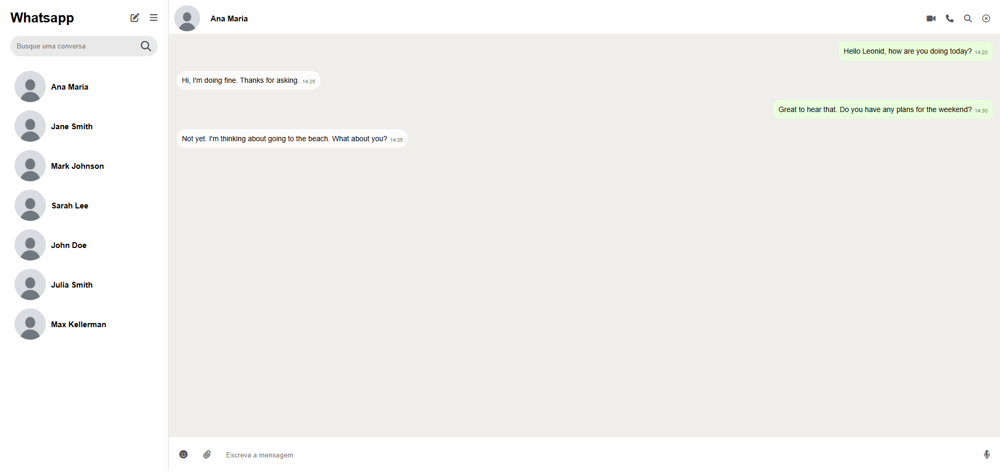

# Site Whatsapp Web

## Site
É um site feito com Html, CSS e JS, em que ele é uma copia do Whatsapp Web, nele o JS consome a API do Whatsapp ([API de própria autoria](https://documenter.getpostman.com/view/48086484/2sB3QFQsNQ)), o site retorna os contatos de um determinado usuário e quando a pessoa clica nesse contato ele abre uma parte só com as conversas entre o usuário e o contato.

## Tecnologias utilizadas para criar o site
* HTML
* CSS
* JS
* API do Whatsapp

## Autor
[Gustavo Pereira](https://www.linkedin.com/in/gustavo-pereira-dev-redes)